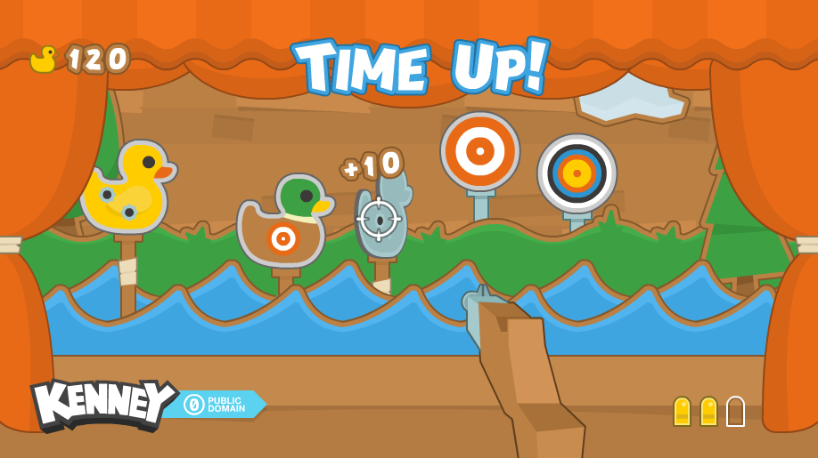

# GoLab 2020 - Game Development with Go

This repository contains support material for the workshop I organized
for [GoLab 2020](https://golab.io/agenda/session/342994)

This workshop was aimed at Go beginners that wanted to start exploring
the language not writing the classic ToDo API app but a "simple" 2D game
using the [Ebiten library](https://ebiten.org/).

Slides are [here](./Slides.pdf)

## Requirements

You must be able to run the [Hello World](https://ebiten.org/tour/hello_world.html)
example from the Ebiten website.

You don't need to have a strong Go knowledge, but I suggest to have at least
seen the [Go tour](https://tour.golang.org/).

## What's in the repository

### Assets

The [./assets](./assets) folder contains all required images and sounds to build the
example game.

Images are both splitted in single files (into [./assets/PNG/](./assets/PNG/)) or into the
spritesheets. Each spritesheet has its own spec JSON file with the position of each image,
as well as its name. If you choose to use the spritesheets, you should use the single
images as reference for file names in the JSON files.

Sounds are both WAV and OGG (vorbis). Ebiten includes decoders for both.

Images come from [Kenney Shooting example](https://www.kenney.nl/assets/shooting-gallery).

### Examples

The [./examples](./examples) folder contains many different examples of what I explain
in the presentation. During the workshop you can use them as reference.

### Shooter game

The [./shooter-game](./shooter-game) folder contains a working example of the shooter
game I asked the attendees to create during the workshop.

As the folder contains the finished game, it's probably not worth it looking at the code
while writing your own game.  

If you need inspiration you should, instead, use the 3 different implementation states,
corresponding to the exercises and tagged in the repo:

* [1st exercise](https://github.com/tommyblue/golab-2020-go-game-development/tree/shooter-1)
* [2nd exercise](https://github.com/tommyblue/golab-2020-go-game-development/tree/shooter-2)
* [3rd exercise](https://github.com/tommyblue/golab-2020-go-game-development/tree/shooter-3)
